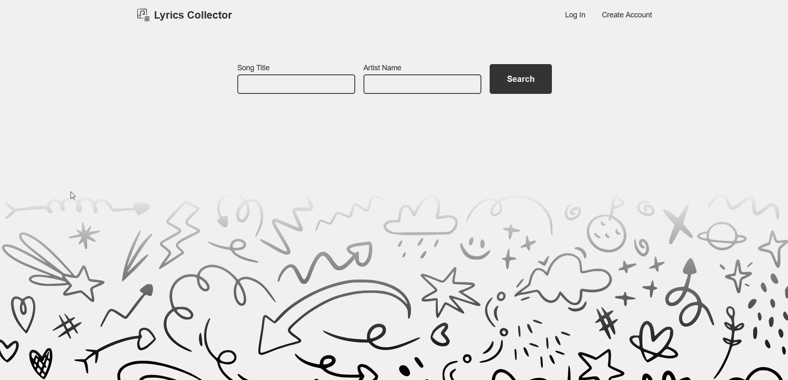
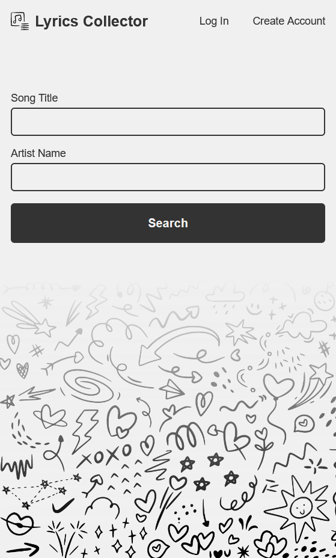

# Lyrics Collector

Lyrics Collector is a website designed for music enthusiasts who love to explore and save song lyrics. The platform offers an intuitive search functionality that allows users to quickly find lyrics from a vast database covering various genres and artists. By creating an account, users can personalize their experience by saving their favorite lyrics to a custom list, making it easy to revisit and share their top picks.

[https://lyrics-collector.netlify.app/](https://lyrics-collector.netlify.app/)
## Screenshots

## Stack 

* React
* Styled Components
* React Router Dom
* Account creation and Login with Firebase
* Database with firestore

## Roadmap

* Add Typescript
* Add testing
* Improve design

## Links

